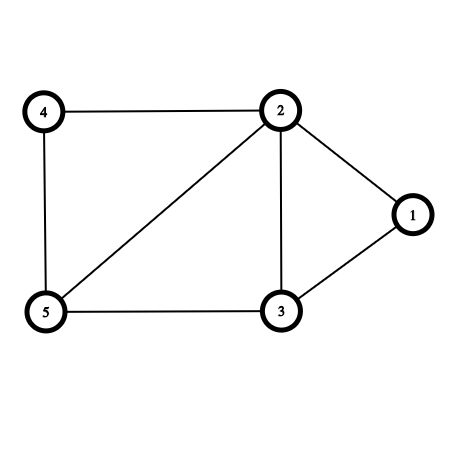
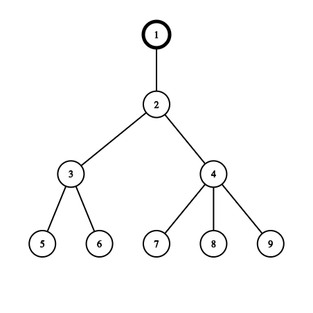

# Graph
Graph Theory is the mathematical theory of the properties and applications of the graphs (networks). 

## Representation of Graph
    - Adjacency Lists
    - Adjacency Matrices 



### Adjacency Lists
Adjacency List representation provides a compact way to represent sparse graphs — those for which |E| is much less than |V|<sup>2</sup>

For the above graph adjacency list will be
```haml
1 -> 2 -> 5 -> /
2 -> 1 -> 5 -> 3 -> 4 -> /
3 -> 2 -> 4 -> /
4 -> 2 -> 5 -> 3 -> /
5 -> 4 -> 1 -> 2 -> /
```

### Adjacency Matrices
Adjacency Matrix representation, however, when the graph is dense — |E| is close to |V|<sup>2</sup> — or when we need to be able to tell quickly if there is an edge connecting two given vertices

```html
  |  1   2   3   4   5
__|___________________
1 |  0  1   0   0   1
2 |  1  0   1   1   1
3 |  0  1   0   1   0 
4 |  0  1   1   0   1
5 |  1  1   0   1   0
```

## Types of Graph
- **Undirected Graph** : An undirected graph is a graph in which edges have no orientation, The edge (u, v) is identical to edge (v, u).
- **Directed Graph (Digraph)** : A directed graph or digraph is a graph in which edges have orientation, ie., the edge (u, v) is the edge from node u to node v.

## Speacial Graphs
- Trees : A tree is an undirected graph with no cycles. Equivalently it is connected with ```N``` nodes and ```N - 1``` edges.
    
- Rooted Tree : 
